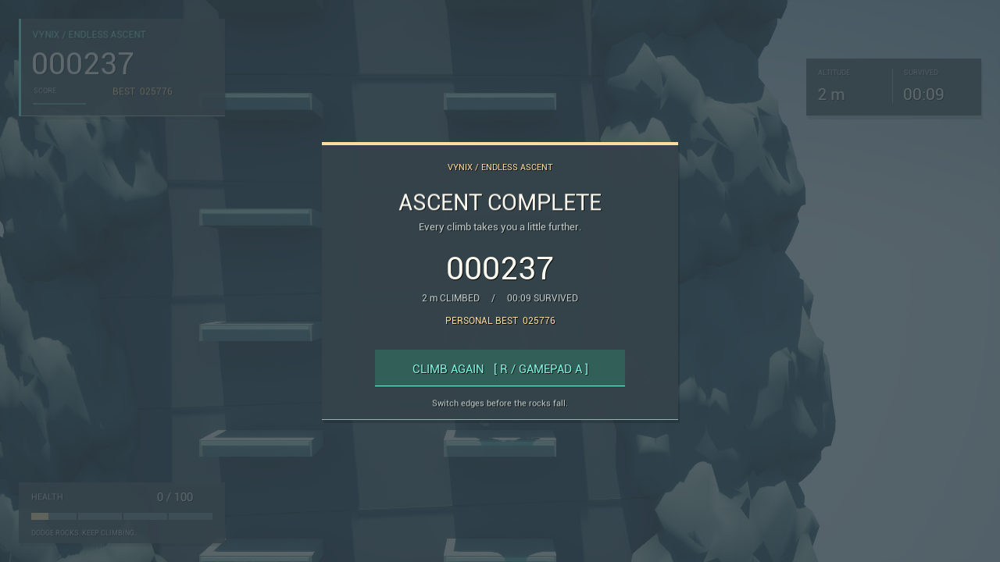
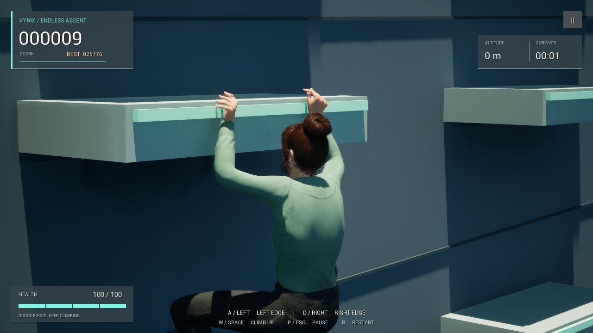
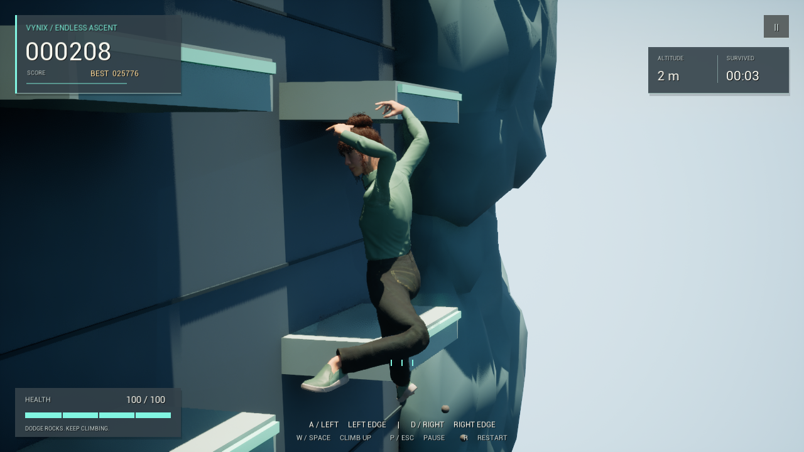

# Validation

Checked on Windows with Unreal Engine **5.5.4**, Visual Studio 2022 / MSVC 14.38, and Windows SDK 10.0.22621.0.

Both **AssignmentEditor / Win64 / Development** and **Assignment / Win64 / Development** compiled and linked successfully.

## Automated gameplay checks

**11 passed, 0 failed**, through `Development/Validate.ps1` on September 6, 2026. The script checks the fresh JSON report as well as process exit status, because Unreal can exit with code zero after a failed test. One retained MetaHuman face Blueprint warning appears on its first load (`Modify Curve` is flagged as potentially thread-unsafe).

| Test | What it checks |
| --- | --- |
| `Rules.JumpTrajectory` | Exact grip endpoints, fixed wall distance, upward arc, mirrored lane jumps, clamped progress |
| `Rules.Score` | Height/time/bonus contributions, monotonic progress, overflow saturation |
| `Rules.Health` | Normal damage, health bounds, rejected negative/NaN/infinite damage |
| `Rules.LedgeBounds` | Nonuniform mesh scale, off-centre pivots, width limits, top height, front clearance, invalid bounds |
| `Runtime.BufferedDodge` | Mid-jump and cooldown input, last valid direction, one-time consumption |
| `Runtime.DamageGraceAndGameOver` | One hit during immunity, subsequent hits, fatal damage, frozen final score |
| `Runtime.EndlessRunAndRecycling` | 100 jumps / 180 metres, capped combo, health milestones, fixed scenery instance counts |
| `Runtime.RockfallTelegraph` | Five warning/release/clear cycles, escape time, one active hazard, sphere physics setup, random delay bounds |
| `Runtime.PaytonAndLedgeClearance` | Original Payton body and clothing, matching animation skeleton, 85 jumps each on three ledge sizes, clearance throughout jumps and recycling, updated rock depth |
| `Runtime.HandContactDuringIdle` | Actual fingertip and wrist positions over 60 evaluated poses on each of three grips, hands released in flight and replanted after landing |
| `Runtime.AnimatedJumpClearance` | 72 evaluated poses per left/right/up jump on three ledge sizes; fixed capsule depth, pelvis following the actor's complete path, head/limb clearance, fingertip contact after landing |

Actor tests use an isolated preview world and do not write player saves. The director test advances its schedule deterministically; it verifies physics configuration rather than pretending to benchmark Chaos simulation.

## Runtime visual check

Launched the actual `EndlessClimb` map through `UnrealEditor-Cmd -game -RenderOffscreen -VynixCapture`. Inspected captures of the initial grip, lateral jump, red rockfall countdown, health loss, game over, pause, and restart. The process exited successfully.

- Cliff materials render with instancing enabled; decorative rocks leave the player and both lanes visible.
- The Canvas text renders at its display size. Score, health, direction hints, and menu controls are readable.
- Pause freezes survival time; resume continues the same run.
- Restart reloads the level and restores full health, zero height, and active run state.
- The Payton class remains resident across restarts. In the capture, the initial legacy asset build took about 70 seconds; subsequent level loads took 0.64 and 0.97 seconds without rebuilding the meshes.
- The capture produces no game errors and does not modify persistent best-run records.
- The capture includes an oblique hand close-up after warming the editor's texture, hair, and shader compilation queues.
- Payton uses her supplied hair cards in the arcade mode; hair remains visible in both the close-up and the gameplay view.
- The additional `-VynixJumpCapture` check produced nine side views at a fixed simulation step. Inspected early, middle, and late poses for right, left, and upward jumps: the body follows the actor's path, and the torso and reaching limbs stay outside the ledge face. The capture exited successfully with no game errors.

## Limits of verification

This does not establish Android-device performance, physical-controller compatibility, or multi-day runtime stability. The original free-climbing prototype remains available, but the automated gameplay suite targets the new endless mode. Packaged distribution still requires Unreal's normal cook/package step.

The `Fab` browser is disabled only in the headless test process because restoring its editor tab without a rendering interface crashes the installed engine plugin. It remains available during normal editing.
