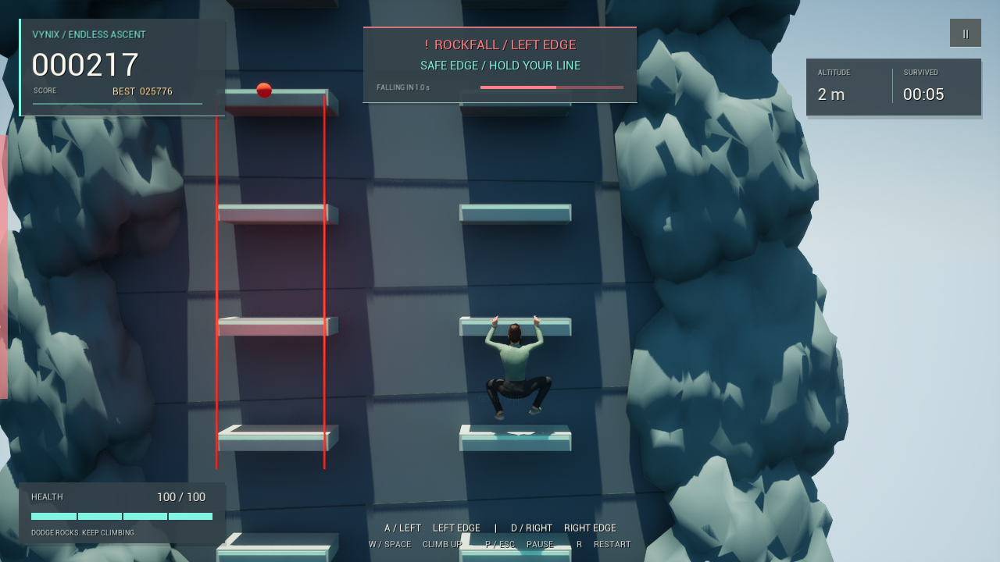

# Vynix Climb Pro

A small Unreal Engine climbing game: keep gaining height, jump between two cliff edges, and move out of the red lane before a stone falls.



## Play

Open `Assignment.uproject` in **Unreal Engine 5.5** and press Play. The default `EndlessClimb` map starts the complete game automatically. For a standalone window, choose **Play > Standalone Game**.

| Control | Action |
| --- | --- |
| A / Left arrow | Jump to the next left edge |
| D / Right arrow | Jump to the next right edge |
| W / Up arrow / Space | Jump up on the current edge; hold to keep climbing |
| P / Escape | Pause / resume |
| R | Start a fresh run |
| Gamepad D-pad left/right, bottom face button | Left / right / upward jump |
| Gamepad Start | Pause / resume |
| Gamepad bottom face button in menus | Resume / restart |
| Touch left/right half below the HUD | Left / right jump |

The pause, resume, and restart buttons also accept mouse clicks. A dodge tapped during a jump is buffered until the next grip and takes priority over held upward movement. In the editor, Escape may stop Play in Editor; use P or play standalone to test the in-game Escape binding.

## What's in the game

- Endless ledges with recycled cliff sections. Height has no designed finish line, and old scenery is reused instead of accumulating.
- The original Payton MetaHuman, including her clothing, face, and hair, with retargeted hanging and jumping animations, chalk trails, jump lean, and a gentle camera response.
- Hanging positions calculated from each ledge's actual mesh bounds, depth, width, and thickness. The capsule stays outside the front, the grip stays away from the corners, and the resting hand height meets the ledge top.
- Two-bone arm IK plants the fingertips at the front lip after the hanging animation is evaluated. Hands release for jumps and replant on landing; the idle motion no longer drives them through the ledge.
- Random small round stones using Chaos physics and continuous collision detection. A pulsing red lane and countdown appear **before** each stone spawns. The other lane stays clear until that stone passes.
- 100 health, 25 damage per stone, and a short grace period after a hit. Every 25 completed jumps restores 10 health.
- Score from height, survival time, and consecutive jumps. Jump again within 2.2 seconds to keep the combo (up to 10). Damage breaks the combo.
- Animated health and damage bars, low-health pulses, direction hints, pause, game over, and locally saved best score/height.

Score is `floor(height in metres * 100 + active seconds * 5 + jump bonuses)`. Each completed jump adds `10 * combo` bonus points. The displayed score saturates at the largest signed 32-bit integer; this does not end a run. Pausing freezes gameplay and survival time.

## Get and build

Install Git LFS before cloning; Unreal assets are stored as LFS objects.

```powershell
git lfs install
git clone https://github.com/vikasyadavwork/VynixClimbPro.git
cd VynixClimbPro
git lfs pull
```

Install Unreal Engine 5.5 and Visual Studio 2022 with **Game development with C++**, the MSVC v143 toolchain, and a Windows SDK. Right-click `Assignment.uproject`, generate Visual Studio project files, then build **AssignmentEditor / Development Editor / Win64**, or run:

```powershell
& 'C:\Program Files\Epic Games\UE_5.5\Engine\Build\BatchFiles\Build.bat' AssignmentEditor Win64 Development "-Project=$PWD\Assignment.uproject" -WaitMutex
```

The project retains its original `Assignment` module name so existing Blueprints and assets continue to resolve. The original prototype remains in `Content/ThirdPerson/Maps/ThirdPersonMap` and `Content/BP_MyCharacter`. The default game uses `Content/Endless/Payton/BP_EndlessPayton`, an arcade version of that character with the original cosmetic construction and a native endless-climbing parent. Its animation clips are retargeted to Payton's skeleton. The large original art library is retained in LFS. Generated binaries, caches, saves, and IDE files are excluded from Git.

## Project layout

| File / folder | Purpose |
| --- | --- |
| `Source/Assignment/EndlessClimber.*` | Jump movement, health, score, input, feedback, persistence |
| `Source/Assignment/ClimbHandIKAnimInstance.*` | Animation playback with hand contact at the actual ledge lip |
| `Source/Assignment/EndlessClimbWorld.*` | Recycled cliff, lanes, and rock warning schedule |
| `Source/Assignment/ClimbFallingRock.*` | Physics stones and damage detection |
| `Source/Assignment/EndlessClimbHUD.*` | Scalable, animated Canvas UI |
| `Source/Assignment/EndlessClimbGameMode.*` | Starts the arena, player, HUD, lighting, and atmosphere |
| `Source/Assignment/ClimbRunRules.h` | Shared movement and scoring calculations |
| `Source/Assignment/Tests/` | Unreal automation tests |
| `Source/Assignment/MyCharacter*` | Original free-climbing prototype |
| `Content/Endless/Payton` | Playable Payton Blueprint, retargeter, and four animation clips |

The arcade loop is implemented in C++ and does not require editing a Widget Blueprint. Best runs live under `Saved/SaveGames/VynixClimbBestRun.sav`. Delete that local file to reset records. This is a single-player desktop game; Android packaging and touch layouts have not been device-tested.

## Check the project

```powershell
powershell -ExecutionPolicy Bypass -File Development/Validate.ps1
```

This builds the editor target and runs the `VynixClimb` automation tests headlessly. The tests cover jump geometry, buffered dodges, score/health bounds, damage immunity, a long climb with bounded scenery, telegraphed rock spawning, and Payton's placement on resized ledges. Reports are written under `Saved/Automation`. See [validation notes](Documentation/Validation.md) for the checked behavior.

To capture a short scripted visual check of ascent, jumping, a warning, health loss, and game over:

```powershell
& 'C:\Program Files\Epic Games\UE_5.5\Engine\Binaries\Win64\UnrealEditor-Cmd.exe' "$PWD\Assignment.uproject" /Game/Endless/Maps/EndlessClimb -game -RenderOffscreen -ResX=1600 -ResY=900 -unattended -nosound -VynixCapture
```

Screenshots go to `Saved/Screenshots`. The capture warms the editor's texture, hair, and shader queues, checks the hand contact from an oblique close-up, and checks pause/resume and level restart. It then exits automatically without writing best-run saves. `Development/CreateEndlessMap.py` can regenerate the small boot map through Unreal's Python commandlet if it is missing.

`LedgeDimensions` on `EndlessClimbWorld` specifies depth, width, and thickness in centimetres. The arena normalizes the mesh using its actual bounds, including an off-centre pivot. The player uses those transformed bounds and the scaled capsule radius with an 8 cm gap; ledges too narrow for that margin are rejected. The cliff faces negative X. Resting hand height is measured from the character's hanging pose, so the model's scale and proportions affect the grip height. Rock spawn depth and warning rails follow the same ledge geometry.

The supplied Payton assets are ready to use. To regenerate them, first run `Development/PreparePaytonAnimations.py` with a full editor's `-ExecutePythonScript` option (UE 5.5's retargeter requires the Content Browser), then run `Development/CreateEndlessPayton.py` after compiling the editor target. The latter keeps the cosmetic construction and replaces the copied prototype EventGraph with the native arcade gameplay.

The arcade character uses Payton's supplied hair cards for consistent rendering across camera distances. Her assets remain loaded across level restarts, avoiding repeated legacy mesh and groom rebuilds. After rebuilding C++ while an older editor session is open, save your work and restart the editor to load the new character code.

## History

The starting game was supplied as a 2023 project without Git history. The February–July 2023 commit dates in this repository are a **reconstructed learning sequence**, arranged at the owner's request; they are not a record of when these changes were actually made. The current project targets Unreal 5.5.

The retained Unreal starter content, MetaHuman assets, and other supplied art remain subject to their respective licenses. No new license is asserted over third-party assets.
